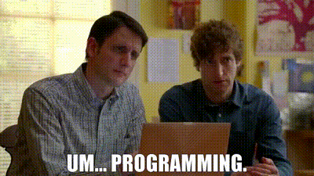

    

<h2 align="left">
    About me:
</h2>

- 📌 I live in San Juan, Argentina
- 👀 I’m interested in Full Stack Developer, Front-End or Back-End!
- 🎯 I specialize in JavaScript, React, Css, HTML, Node, Express, Sequelize and SQL
- 🌱 I’m currently learning English language, Java, Phyton, NestJs, MongoDB...
- 🎓 I studied at Henry,Formar with Digital House and Oracle Next Education. Studying autonomously
- 💞️ I seek to learn and grow as much as possible in the IT area
- 🏀 I like basketball and rock and roll

 
 
<h2 align="center">
    Connect with me:
</h2>

    
    
    
    
    

    

 
 

<h2 align="center">
    Languages and Tools:
</h2>
<h5 align="center">

</h5>
<h5 align="center">

</h5>

<h5 align="center">

</h5>

 
 
 
<h2></h2>
<h2 align="center">
    

</h2>
 
<h2 align="center">

</h2>

 
 

    
    

    

 
 

  

