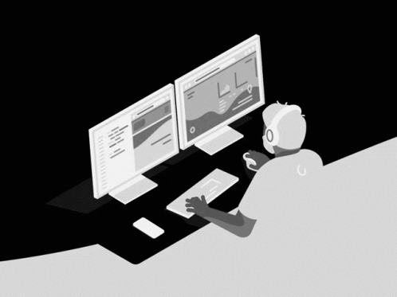

    
    

 

<h2 align="left">
    About me:
</h2>

- 📌 I live in San Juan, Argentina
- 👀 I’m interested in Full Stack Developer, Front-End or Back-End!
- 🎯 I specialize in JavaScript, React, Css, HTML, Node, Express, Sequelize and SQL
- 🌱 I’m currently learning English language, TypeScript, NextJs, NestJs, GraphQL, MongoDB...
- 🎓 I studied at Henry and Formar with Digital House. Studying at Oracle Next Education and autonomously
- 💞️ I seek to learn and grow as much as possible in the IT area
- 🏀 I like basketball and rock and roll

 
 
<h3 align="left">
    Connect with me:
</h3>

    
    
    
    
    

 
 

<h2 align="center" style="font-weight: bold; font-size: 32px">
    Languages and Tools:
</h2>
<h2 align="center">

</h2>
<h2 align="center">

</h2>

<h2 align="center">

</h2>

 
 
 

<h2 align="center">

</h2>

<h2 align="center">

</h2>

 
 

    
    

    

 
 

  

